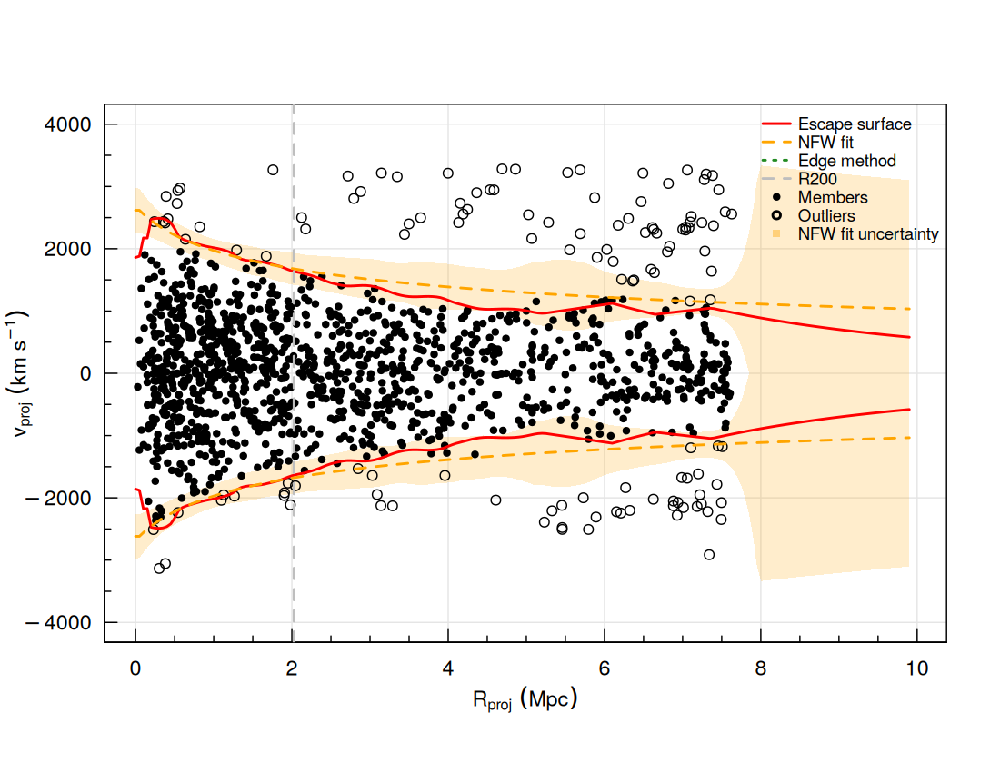
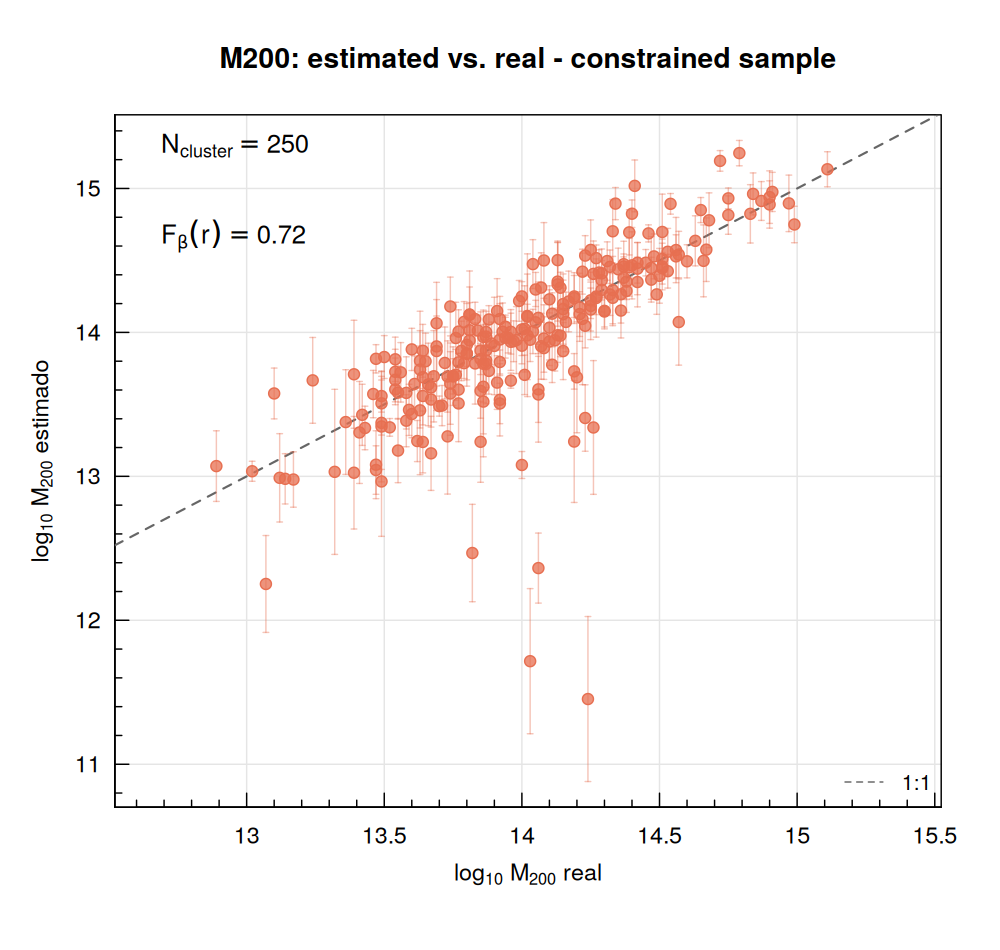
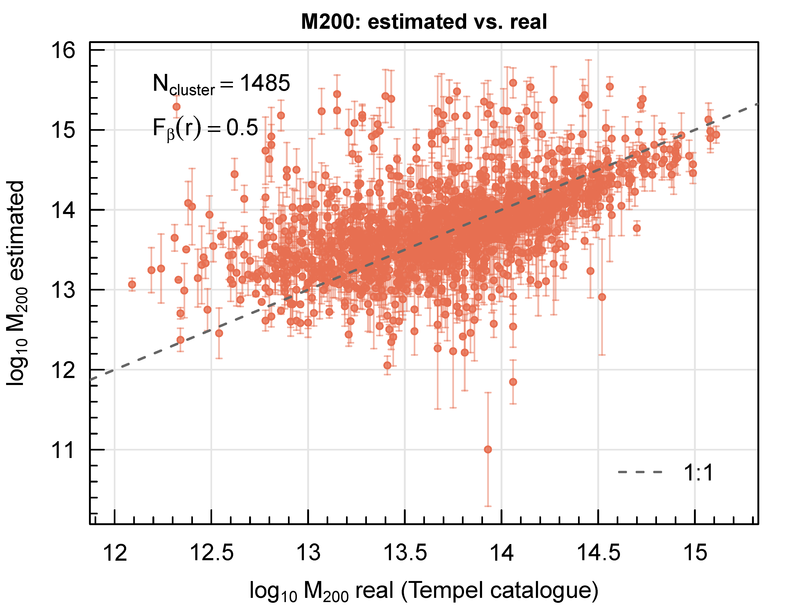

# Caustic Mass Estimator for Galaxy Clusters

This started as an R port of the Caustic Mass Estimator for Galaxy Clusters developed in Python by [Gifford et al.](https://github.com/giffordw/CausticMass), but has since diverged substantially: several bugs in the original implementation were found and fixed (missing radial mirroring in the density estimate, linearly- rather than log-spaced contour levels, no gradient restriction on contour tracing, among others), and its key parameters were recalibrated and validated against hundreds of real clusters (Tempel et al. 2017, CIRS/Rines & Diaferio 2006, plus individual literature clusters like Coma and Abell 2029) rather than left at their original literature defaults. See [docs/parameter_calibration.md](docs/parameter_calibration.md) for the full record of what was tested, what changed, and the evidence behind each choice. A pre-cleaning of interlopers is recommended, using e.g., the shifting-gapper technique (included in this file as `shifting_gapper()`).

The caustic technique infers cluster mass profiles out to several virial radii, into the surrounding infall region -- a regime where virial-type mass estimators don't apply, since they assume the system has reached dynamical equilibrium and infalling material hasn't. It works by identifying the escape-velocity edge (the "caustic") in a cluster's projected phase-space diagram, i.e. line-of-sight velocity plotted against projected clustrocentric radius: galaxies bound to the cluster trace out a characteristic trumpet-shaped envelope that narrows with radius, and the amplitude of that envelope at each radius, A(r), gives the escape velocity there. Since escape velocity is directly tied to the gravitational potential, integrating A(r)² over radius (scaled by F_β(r), a velocity-anisotropy correction that is this method's main free parameter -- see `fbr` below) yields the enclosed mass profile without needing to assume equilibrium anywhere, using only redshifts. This method was introduced by [Diaferio & Geller (1997)](https://arxiv.org/abs/astro-ph/9701034) and [Diaferio (1999)](http://arxiv.org/abs/astro-ph/9906331), with the NFW-fitting refinement of [Serra et al. (2011)](https://arxiv.org/abs/1109.5178).

## Installation

```r
install.packages(c("imager", "magicaxis"))
```

`magicaxis` is only needed for the optional diagnostic plot (`plot=TRUE`); everything else runs without it.

## Basic usage

Run the code, here using the sample data provided -- candidates around the Coma cluster (Abell 1656), extracted from SDSS DR20 -- with unknown values of R200 and cluster velocity dispersion (blind mode):

```r
source("RCausticMass.R")
data = read.table("coma_sample.txt", header = TRUE)
data = subset(data, CID == 1)
r = run_caustic(data$dproj, data$vlos, data$zclus[1], r200 = NA, clus_vdisp = NA, fbr = 0.50)
```

If R200 and the velocity dispersion are known from an external catalogue, pass them and set `fix_r200 = TRUE` for a more precise, informed run:

```r
r = run_caustic(data$dproj, data$vlos, data$zclus[1], r200 = 2.23, clus_vdisp = 947, fix_r200 = TRUE)
```

Setting `plot=TRUE` gives a full diagnostic figure -- the escape surface, the fitted NFW curve, its uncertainty band (shaded, from the same per-radius D99/Serra et al. 2011 error estimate used for the M200 error bar), R200, and the member/outlier split:

```r
r = run_caustic(data$dproj, data$vlos, data$zclus[1], fbr = 0.50, plot = TRUE)
```

<p align="center">
  
</p>

The smoothed phase-space itself can also be plotted directly:

```r
image(r$x_range, r$y_range, r$img_tot, asp = NA, las = 1, xlab = expression(R[proj] ~ (Mpc)),
      ylab = expression(v[proj] ~ (km/s)))
```

**How well did it do?** Coma is well-studied enough to check: the blind-mode run above (1743 candidates) gives

| | This run | Literature (Sohn et al. 2017, same caustic technique) | Difference |
|---|---|---|---|
| R200 | 2.03 Mpc | 2.23 Mpc | -9% |
| M200 | 9.68×10¹⁴ M☉ | 1.29×10¹⁵ M☉ | -25% |
| Velocity dispersion | 897 km/s | 947 km/s | -5% |

close to what the method's own reported uncertainty would suggest for this richness.

That comparison uses another caustic-technique measurement as the reference, though, which isn't a fully independent check. A fairer one: the median of six *non*-caustic mass estimates in the literature for Coma (X-ray, virial, weak lensing, Jeans analysis, and two data-driven methods) is 7.0×10¹⁴ M☉ -- and this run's M200 (9.68×10¹⁴) actually sits *closer* to that independent consensus than to Sohn et al.'s own caustic-based value. That said, "closer" shouldn't be read as "correct" -- these independent techniques disagree with each other by up to a factor of ≈3.5 (0.53-1.88×10¹⁵ M☉ across the six), so the consensus itself carries real uncertainty, and a controlled simulation study (Old et al. 2018, using the Cluster-EAGLE mocks with known true mass) found that caustic and virial masses both tend to run ≈30-50% high relative to X-ray hydrostatic mass specifically. There is no single agreed-upon "true" mass for Coma to validate against -- see [docs/parameter_calibration.md](docs/parameter_calibration.md) for the full multi-technique comparison and what was learned trying to use it to calibrate `fbr`.

See [docs/parameter_calibration.md](docs/parameter_calibration.md) also for the same Sohn-based test on a second cluster (Abell 2029) and in informed mode, including a case where fixing R200 to its known value made the estimate *worse* -- a useful reminder that informed mode is more precise *on average*, not a guaranteed improvement for every individual cluster.

## Main functions

| Function | Purpose |
|---|---|
| `run_caustic()` | The core estimator: R200, M200, velocity dispersion, membership, and uncertainties from a cluster's projected phase-space (`dproj`, `vlos`). Works blind (no prior) or informed (`fix_r200=TRUE`, given R200/velocity dispersion). With `plot=TRUE`, also shows the fitted NFW escape curve's uncertainty band (D99/Serra et al. 2011 per-radius error, the same one behind the M200 error bar). |
| `run_caustic_robust()` | Wrapper around `run_caustic()` that retries automatically on either of two recognised failure modes: `"the contours do not expand to the radial limit"` (retries with a smaller `rlimit`) or `"too few galaxies for a blind preliminary R200 estimate"` (retries with a smaller `min_n`). Recovered results are less precise on average — see the function's own documentation before trusting them. |
| `run_caustic_bootstrap()` | Runs `run_caustic()` over many galaxy resamples to obtain an empirical uncertainty estimate (distinct from the analytic D99 error). |
| `extend_outliers_nfw()` | Extends outlier/member classification to the *full* range of `dproj`, extrapolating the fitted NFW escape-velocity curve beyond the radius `run_caustic()` actually analysed. Also available directly as `caustic_outliers_extended` in `run_caustic()`'s own output. |
| `shifting_gapper()` | Interloper removal via the shifting-gapper technique (Fadda et al. 1996). |

## Advanced tuning parameters

Beyond `fbr`, a few lower-level parameters of `run_caustic()` were validated against three independent samples (two Tempel et al. 2017 extractions plus CIRS, Rines & Diaferio 2006) and are worth knowing about:

| Parameter | Default | Notes |
|---|---|---|
| `blur_gaussian` | `FALSE` | Controls `isoblur()`'s internal filter: `FALSE` uses the Deriche filter, `TRUE` uses Young-van Vliet (closer to a true Gaussian, but validated as never better and sometimes substantially worse — up to ≈25-28% more M200 scatter on noisier extractions). |
| `gradu` | `1.0` | How fast a candidate contour's amplitude is allowed to grow with radius while tracing the escape surface. Inherited unchanged from causticpy at `0.5` originally; found never worse and sometimes clearly better at `1.0`. |
| `gradd` | `2.0` | Same idea for how fast the amplitude may fall. No detectable effect over the range tested; left at its original value. |
| `q` | `10` | Compresses the velocity axis relative to radius before the isotropic 2D kernel is applied. **Not recommended to change from a single default** — like `fbr`, its optimum is extraction-geometry-dependent and swings in *opposite* directions between datasets tested (favoring `q≈4-6` for a wide fixed-radius extraction, `q≈10` for a narrow membership-constrained one). Recalibrate jointly with `fbr` if you touch it. |
| `mirror` | `TRUE` | Duplicates each galaxy at `+vlos` and `-vlos` before density estimation, assuming a symmetric velocity distribution. Best left `TRUE` for a general, unclassified sample. **If the cluster is known in advance to be dynamically unrelaxed** (merging/infalling), `mirror=FALSE` measurably improved both bias and scatter in testing — the assumed symmetry can discard real signal (relative motion between substructures) rather than just cleaning up noise. Not the same thing as the always-on radial (`r → -r`) mirroring, which has no on/off switch. |

A further round of experimental parameters (`combine_branches`, `mass_curve`, `mass_smooth_spar`, `mass_r_min`, `fit_r_upper_mult`, `fit_r_lower_div`, `blind_refit`, `level_spacing`) were implemented and tested against real clusters — none improved on the current defaults, so they were **removed again after testing** rather than kept in the code as unused options. Several revealed useful structural facts about the code along the way (e.g. the default mass estimate never actually uses the NFW-fit curve). See [docs/parameter_calibration.md](docs/parameter_calibration.md) for the complete results and the reasoning behind each, including one still-unexplained observation (a minority of clusters show a declining escape-velocity curve near the centre) left open for future investigation.

`neumann` (boundary conditions in `isoblur()`) and the density-grid resolution (`grid_by`, `nlevels`) were also tested and found to have negligible or ambiguous effect — left at their original defaults.

For the full calibration process (all sweeps, what was tried and didn't work, and the raw numbers behind these choices), see [docs/parameter_calibration.md](docs/parameter_calibration.md).

## Validation

Tested against the Tempel et al. (2017) group catalogue (0.02 < z < 0.1, 2139 groups), comparing blind-mode M200 estimates (no external prior) against the catalogue's own masses, for two different candidate-extraction conventions:

| | Extraction | N clusters | F_β(r) |
|---|---|---|---|
| **Constrained** | 3×R200, velocity window constrained by Tempel's own confirmed members | 250 | 0.72 |
| **Unconstrained** | Fixed 10 Mpc radius, ±4000 km/s velocity window | 250 | 0.50 |

<p align="center">
  
  
</p>

Both use the same method with an F_β(r) calibrated for their respective extraction geometry, and the difference is visible: **how candidates are extracted matters as much as the method itself.** The proportional extraction (left), with a velocity window tied to real cluster membership, recovers M200 with substantially less scatter than the fixed-radius, wide-window extraction (right) -- even though both use blind mode (no external R200 prior) and both had F_β(r) independently optimized for their own geometry.

See [docs/validation.md](docs/validation.md) for the full comparison, including R200 recovery and informed-mode (R200 fixed) results for both extractions, a third independent sample (CIRS), and a cosmological-simulation check (TNG300) against true, not measured, mass -- which also isolates a fundamental precision limit (line-of-sight projection angle) that no parameter choice can fix.

**Known caveat**: in blind mode, the fixed-radius extraction shows a clear tendency to overestimate R200 specifically for low-R200 clusters (a factor of 2-3x for some clusters with true R200 ≈0.3-1 Mpc) -- see the R200 panel in [docs/validation.md](docs/validation.md). This is consistent with the wider extraction geometry diluting the phase-space signal more severely for intrinsically smaller systems.

## Known limitations

- **Blind mode is substantially less precise than informed mode.** If you have R200 and velocity dispersion from an external catalogue, use them (`fix_r200=TRUE`) — the difference in accuracy is large, not marginal.
- **`fbr` (the β-factor used in the mass integral) is not universal.** Its optimal value depends on the extraction geometry (fixed-radius vs. proportional-to-R200, wide vs. narrow velocity window), not just the cluster sample itself. Recalibrate against known masses when possible rather than trusting a single default across very different datasets. It also depends on cluster mass specifically (confirmed in two independent samples: the most massive clusters need close to double the `fbr` of the least massive ones, causing systematic underestimation of massive clusters with a single dataset-wide value) -- richness does not show the same pattern, so this isn't just "poorly-sampled clusters behave differently." This is a real population-level effect, not a reliable per-cluster correction: no single "true" mass exists to calibrate it against (caustic, virial, X-ray, and weak lensing masses all carry their own known systematics and disagree with each other), and individual-cluster scatter is large enough that applying a mass-based `fbr` correction can as easily hurt as help any one specific cluster. **`run_caustic()`'s own `fbr` default was changed from an earlier, less-specific value (0.6) to 0.50**, chosen as the more reasonable starting point for the most common real-world case -- candidates pulled from a catalogue within a fixed projected radius, no membership prior -- but this is a starting point to actively reconsider, not a value to trust blindly; see the function's own extensive in-code documentation and the table above for how it should shift with your extraction convention. See [docs/parameter_calibration.md](docs/parameter_calibration.md) for the numbers.
- **`q` behaves the same way as `fbr`** — extraction-geometry-dependent, with no single default that serves all cases well (see Advanced tuning parameters above).
- **Convergence depends strongly on richness.** Clusters with fewer than ≈15-20 candidate galaxies often can't be fit reliably in blind mode; this is a data limitation, not a bug. Beyond convergence itself, precision also depends on richness: results with fewer than ≈6 galaxies inside the *estimated* R200 (`N200`) show substantially worse bias and scatter than richer clusters, even when they do converge -- see [docs/parameter_calibration.md](docs/parameter_calibration.md) for the numbers.
- **`run_caustic_robust()`'s recovered results can be confidently wrong.** Their own reported uncertainty (`M200_err_frac`) is not a reliable indicator of how far off they may be — treat any result where `rlimit_frac_used` or `min_n_used` is not `NA` as lower-confidence, regardless of its error bar.
- **The caustic technique itself does not model Fingers-of-God distortion** (the velocity elongation of a cluster's core caused by peculiar-velocity dispersion when viewed nearly face-on). This is a structural limitation of the method (Serra & Diaferio 2013), not something any parameter here can fix -- it can cause genuine core members to be missed regardless of tuning.

## License

MIT — see [LICENSE](LICENSE).

## Citation

See [CITATION.cff](CITATION.cff), or cite Diaferio & Geller (1997), Diaferio (1999), and Serra et al. (2011) for the underlying method.

---

Author: Dailer F. Morell
