# Validation against Tempel et al. (2017)

All comparisons use the Tempel et al. (2017) group catalogue, restricted to 0.02 < z < 0.1 (2139 groups), as the source of both candidate galaxies and the "real" R200/M200 values plotted on the x-axis. Two candidate-extraction conventions were tested, since (as found throughout development) the method's precision depends substantially on how the input sample is built -- not only on the caustic-fitting method itself.

Each panel below uses a random sample of 250 clusters for which `run_caustic()` converged in that specific mode (blind or informed) -- not necessarily the same 250 clusters across panels, since convergence depends on the mode and extraction. Error bars: `M200_err` is native (D99/Serra et al. 2011 formula); `R200_err` is derived by propagation from `M200_err` via M200 ∝ R200³, since R200 has no native uncertainty outside bayesian mode.

## Extraction conventions

**Constrained**: candidates within 3×R200 (R200 from Tempel's own catalogue), with the velocity window (|vlos|) constrained to the maximum |vlos| among Tempel's own confirmed members for that cluster. This ties the extraction directly to real cluster membership.

**Unconstrained**: candidates within a fixed 10 Mpc projected radius, with a fixed ±4000 km/s velocity window, regardless of cluster size. A more common convention when candidates are pulled from an external catalogue without prior knowledge of true membership.

`F_β(r)` was independently calibrated for each extraction (0.72 for Constrained, 0.50 for Unconstrained) -- see the main repository README for why a single default does not transfer between extraction geometries.

## Blind mode (no external prior)

R200 and M200 are both estimated from the data alone, with no R200/velocity-dispersion prior supplied.

### R200

| Constrained (N=250) | Unconstrained (N=250) |
|---|---|
| 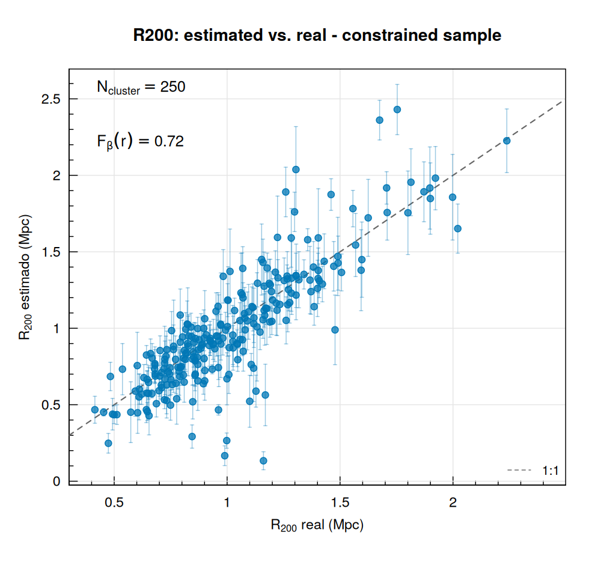 | 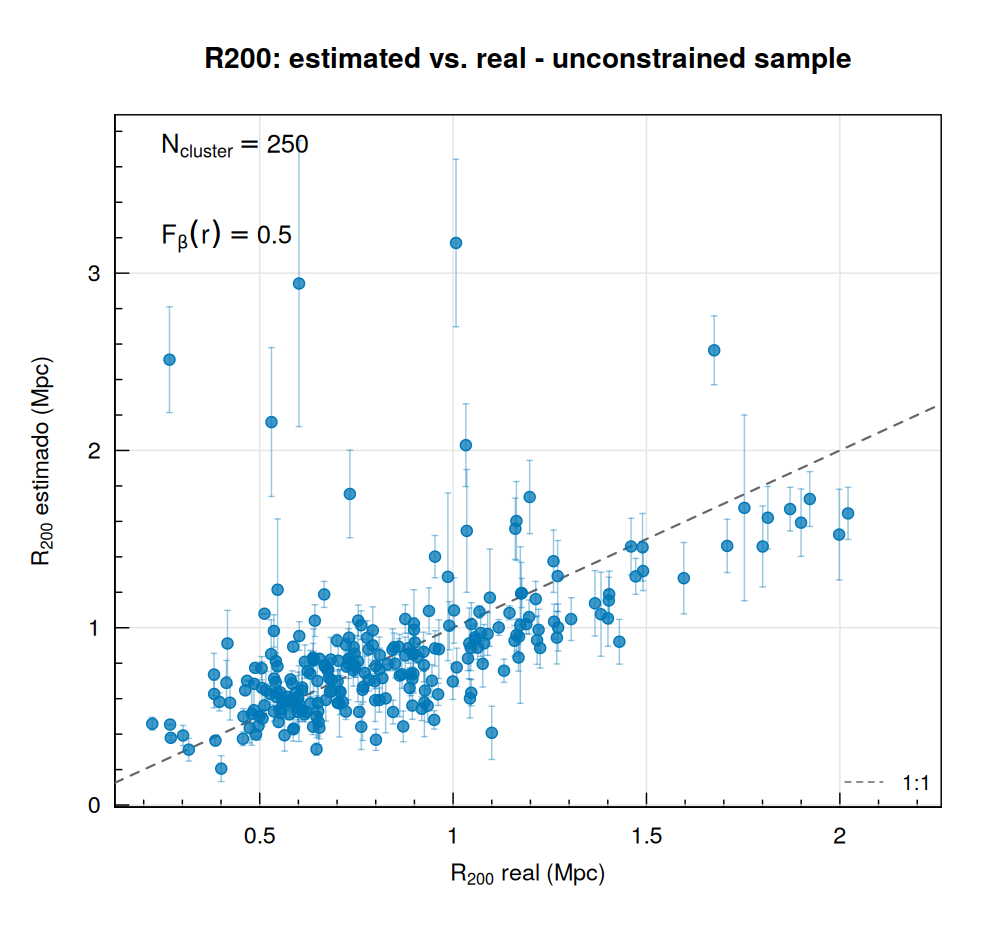 |

The unconstrained extraction shows a clear tendency to **overestimate R200 for intrinsically small clusters** (true R200 ≈0.3-1 Mpc), by a factor of 2-3x in a substantial number of cases. This is consistent with a wider, fixed-radius field diluting the phase-space signal more severely for smaller systems -- see the main README's discussion of extraction-geometry effects.

### M200

| Constrained (N=250) | Unconstrained (N=250) |
|---|---|
|  |  |

The R200 bias above propagates directly into M200 (mass is integrated up to the estimated R200), compounding the unconstrained extraction's lower precision.

## Informed mode (R200 fixed)

R200 is held fixed at Tempel's own catalogue value; only M200 (and concentration) are estimated from the data.

| Constrained (N=250) | Unconstrained (N=250) |
|---|---|
| 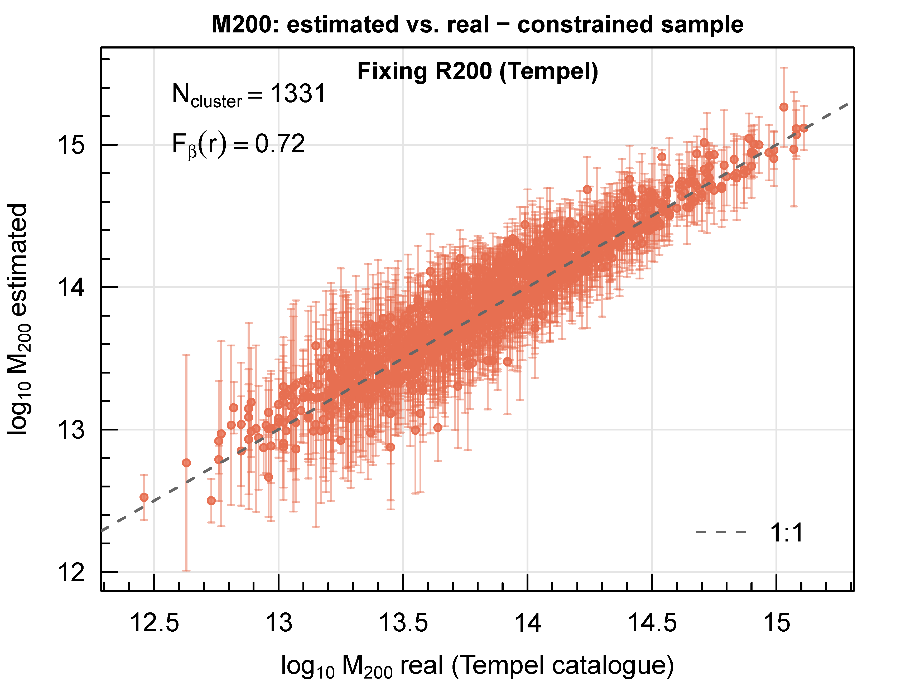 | 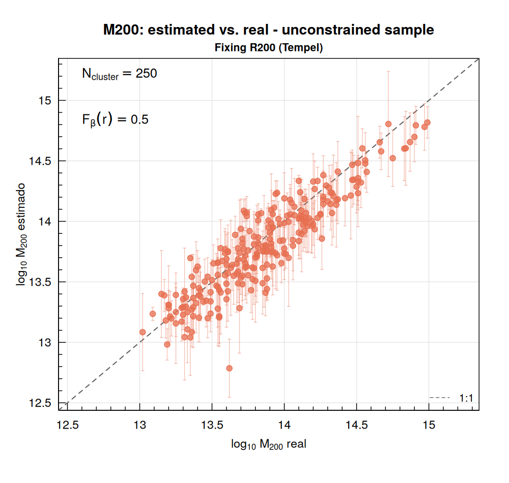 |

Fixing R200 removes a major source of noise in both cases -- compare against the blind-mode M200 panels above. The constrained extraction still outperforms the unconstrained one even here, though the gap narrows substantially compared to blind mode.

## A third, independent sample: CIRS (Rines & Diaferio 2006)

Tempel above is our own extraction, from a broad group catalogue. CIRS is a genuinely independent sample -- a different survey, different candidate selection, different R200/M200 measurements (both from the caustic technique, but an entirely separate analysis) -- and is used throughout this project's calibration work specifically as a cross-check against overfitting to Tempel's own conventions. `F_β(r)=0.44`, calibrated the same way as the two Tempel extractions above.

| R200, blind (N=67) | M200, blind (N=67) | M200, informed (N=63) |
|---|---|---|
| 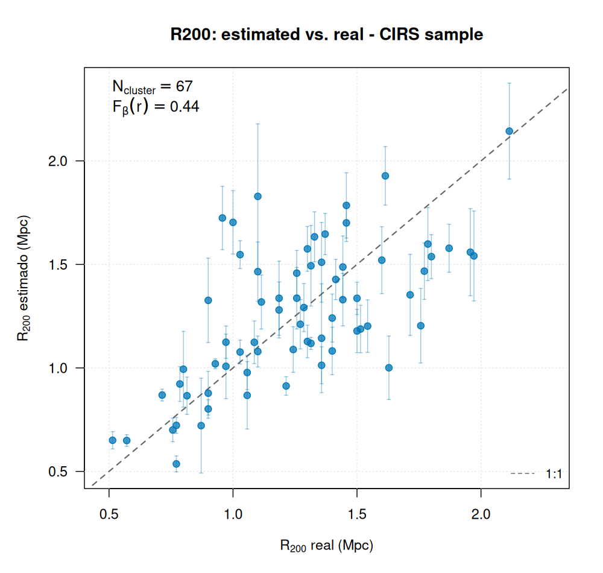 | 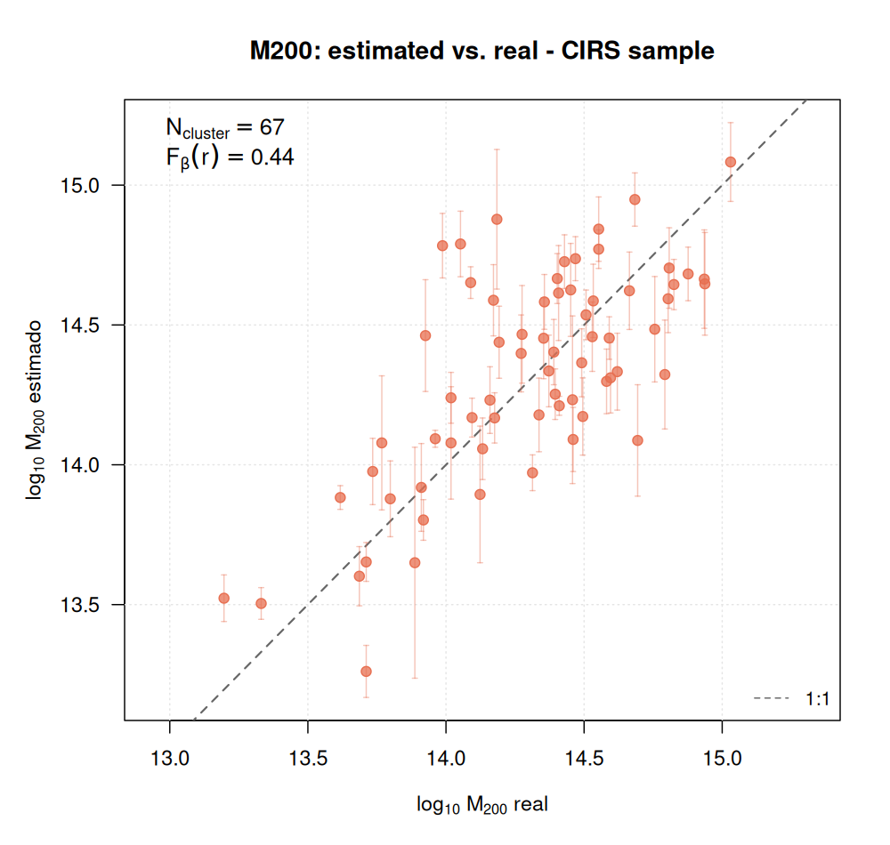 | 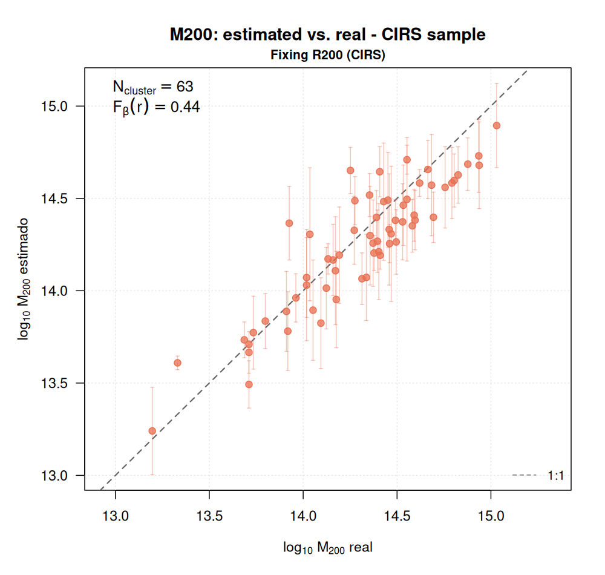 |

The same blind-vs-informed pattern holds here as for Tempel: informed mode visibly tightens the scatter around the 1:1 line. CIRS's own precision sits between the two Tempel extractions -- unsurprising, since its candidate-selection convention (fixed radius, similar in spirit to "Unconstrained") is less tightly tied to true membership than "Constrained" is, but the underlying data and target selection differ enough from Tempel that it isn't a direct apples-to-apples comparison of extraction geometry alone.

## A fourth check: cosmological simulation ground truth (TNG300)

Everything above compares against *measured* masses, which -- as [docs/parameter_calibration.md](parameter_calibration.md) documents at length -- carry their own technique-dependent systematics. TNG300 (IllustrisTNG, z=0.06) provides an alternative with no such ambiguity: true M200/R200 and true 3D membership for every halo, with mock "observations" built by projecting the real 3D data along a line of sight, the same way a real telescope only ever sees one projection of a real cluster. The full sample spans 11,942 groups from logM200=12.5 (poor groups, ≈40 members typically) up to 15.16 (the most massive halo in the box, ≈11,650 members) -- not just the handful of massive clusters used for the first pass at this test.

| R200, blind (N=75, full mass range) | M200, blind (N=75, full mass range) |
|---|---|
| 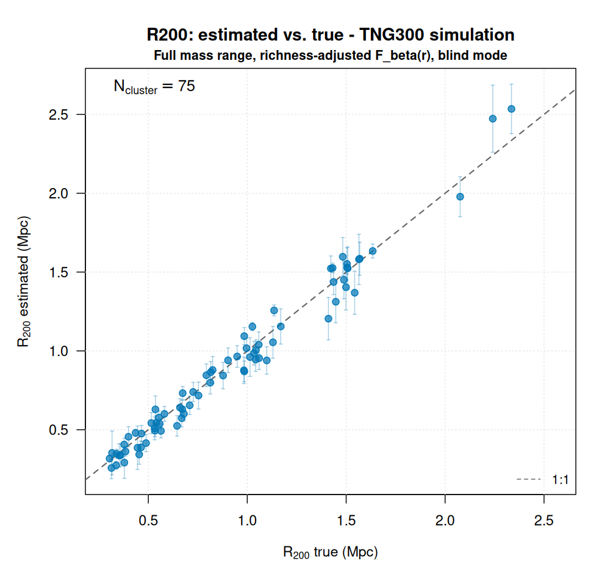 | 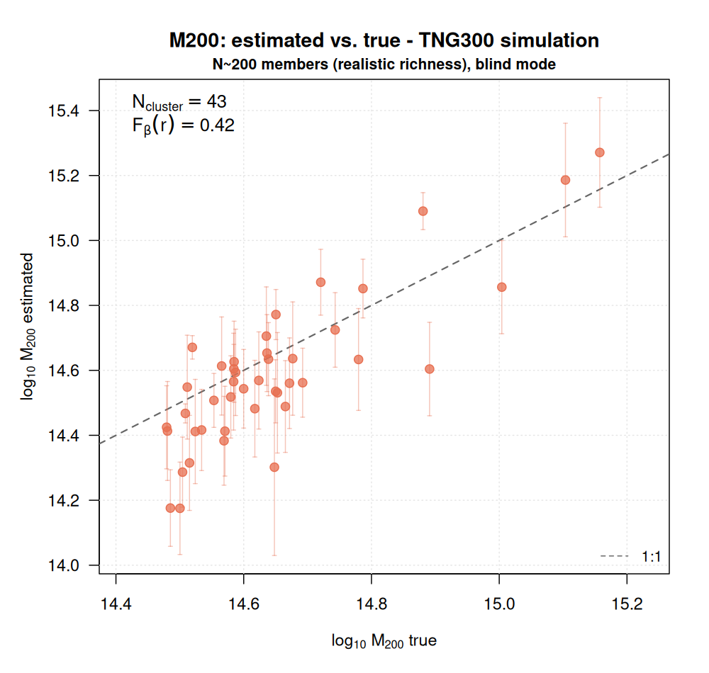 |

`F_β(r)` is not a single number here -- see below and [docs/parameter_calibration.md](parameter_calibration.md) for why. Each cluster in these two panels used an `F_β(r)` interpolated from its own richness (≈0.42 for the richest, ≈0.60 for the poorest, ≈0.48 in between), which is what keeps both panels close to the 1:1 line across nearly three decades in mass.

Informed mode (R200 fixed at its true value) was also tested:

  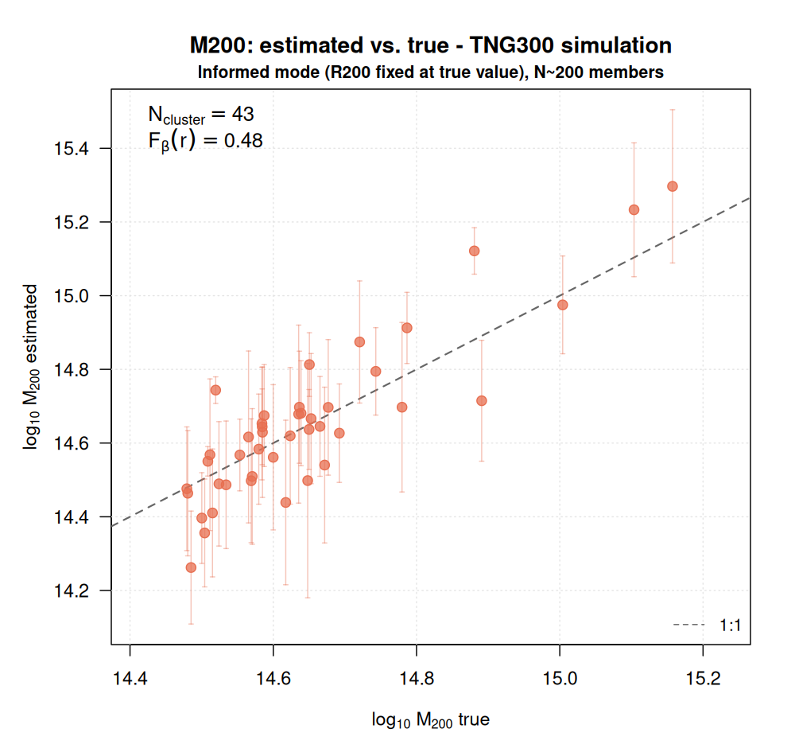

Once `F_β(r)` is correctly calibrated for a given richness, informed mode is again more precise than blind mode at the same richness (M200 sd=0.118 vs. 0.127 dex across the same 75-cluster, full-mass-range sample) -- a smaller gap than the ≈15-20% typically seen against real-data samples elsewhere in this document, but the same direction, now confirmed against true rather than measured mass.

**Richness, not mass, turns out to be what `F_β(r)` actually tracks.** A first pass at this test (holding richness fixed at approximately 200 for every cluster while mass varied) found almost no mass-dependence, seemingly contradicting the mass-dependent `F_β(r)` trend found against real Tempel/CIRS references elsewhere in this project. Testing the *full* mass range above -- where richness is allowed to vary naturally with mass, as it does in any real cluster sample -- resolved this: the correct zero-bias `F_β(r)` is ≈0.42 at the richest end (median ≈2300 members), ≈0.47-0.48 at N≈200, and ≈0.60-0.61 for poor, low-mass systems (N≈60-100) -- a clean, monotonic relationship with richness. Since richness and mass are naturally correlated in any real cluster population, this is very likely the real explanation for why the original real-data comparison looked mass-dependent in the first place.

**The most important result from this sample isn't in the scatter plot above -- it's this:**

  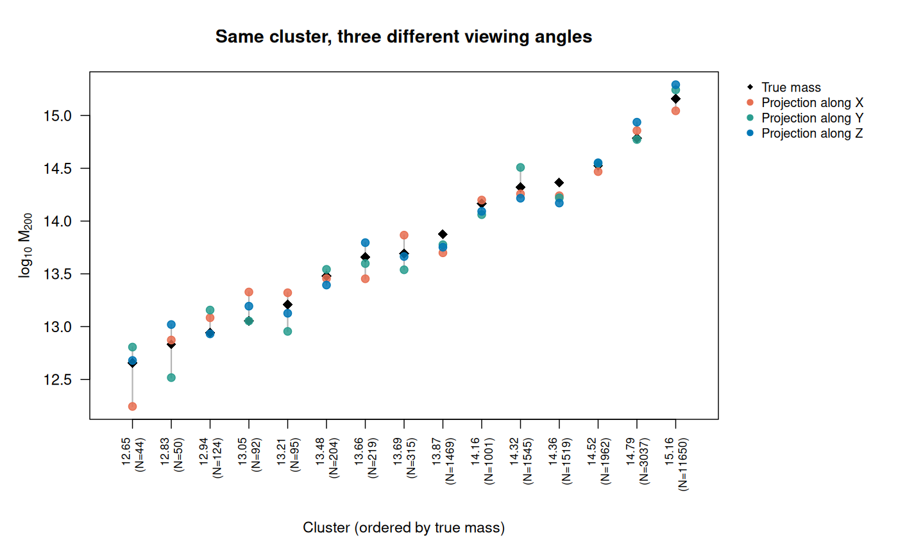

Because simulation data allows viewing the *same* physical cluster from multiple angles (something no real observation can ever do), 15 clusters spanning nearly three decades in mass (logM200≈12.65 to 15.16, richness N=44 to 11,650, three per mass bin) were each mock-observed along all three Cartesian axes. The spread from viewing angle alone is real at every mass scale shown, not just for the richest systems -- the poorest group's estimate shifts by up to ≈0.55 dex depending on which axis it's viewed from, and the effect remains substantial (a few tenths of a dex) even for the most massive, richest halos. Averaged across all 15 clusters, this effect corresponds to sd≈0.13 dex per cluster from viewing angle alone -- comparable to, and in this broader mass-range test somewhat larger than, the *entire* scatter measured across different clusters anywhere else in this document. Put differently: a large fraction of what looks like "estimation error" when comparing to a real cluster's mass may not be reducible by any algorithmic improvement at all -- it's a geometric consequence of which direction we happen to be looking at that specific cluster from. See [docs/parameter_calibration.md](parameter_calibration.md) for the full analysis, including how this finding revises two earlier conclusions in this project (the mass-dependence of `fbr`, and the `mirror` parameter's relationship to cluster dynamical state).

## Summary

| Extraction | Mode | N |
|---|---|---|
| Constrained (Tempel) | Blind | 250 |
| Constrained (Tempel) | Informed | 250 |
| Unconstrained (Tempel) | Blind | 250 |
| Unconstrained (Tempel) | Informed | 250 |
| CIRS | Blind | 67 |
| CIRS | Informed | 63 |
| TNG300 simulation | Blind, full mass range (logM200=12.5-15.16), richness-adjusted F_β(r) | 75 |

**Takeaway**: both the extraction geometry (proportional vs. fixed-radius, membership-constrained vs. fixed velocity window) and the availability of an external R200 prior have a first-order effect on precision -- comparable to or larger than most algorithmic refinements to the fitting method itself. The TNG300 comparison adds a further, more fundamental one: line-of-sight projection angle alone can contribute as much scatter as everything else combined, a limit no amount of parameter tuning can overcome. See the main README's "Known limitations" section, and [docs/parameter_calibration.md](parameter_calibration.md) for the detailed calibration process behind the current defaults.
